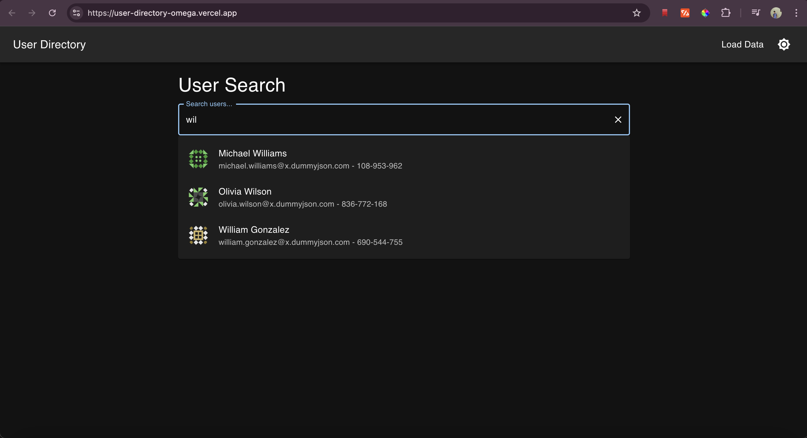
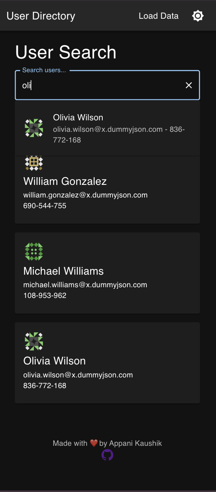
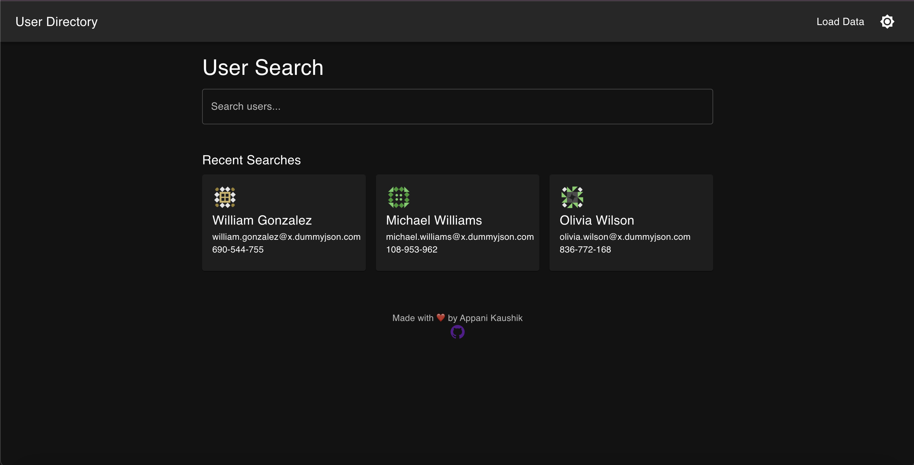
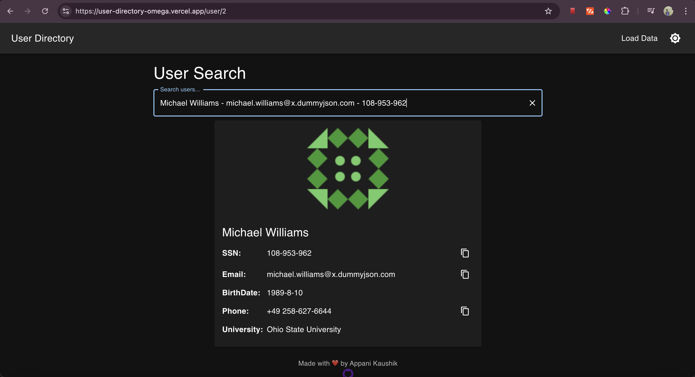
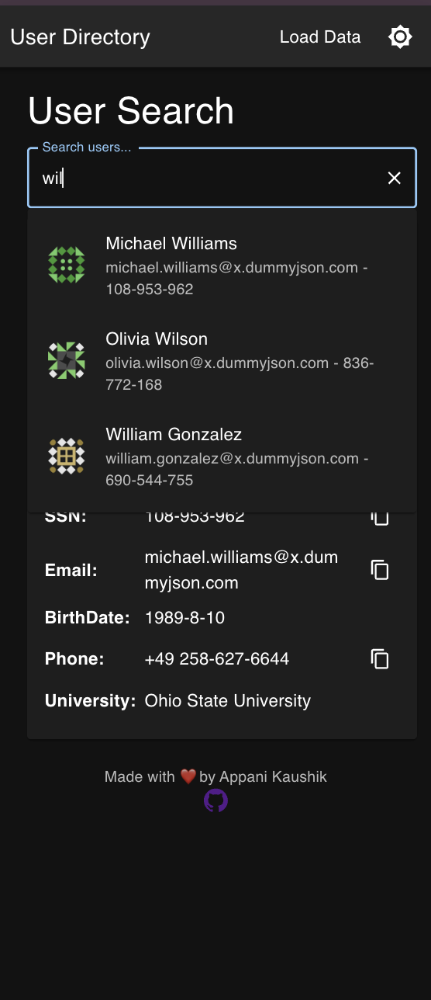
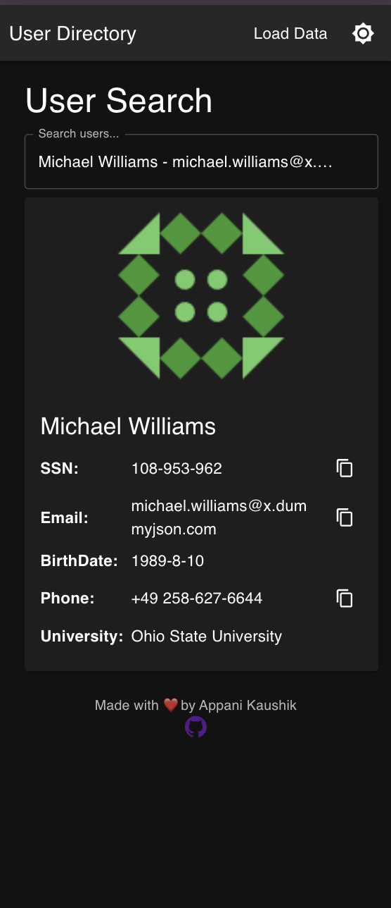
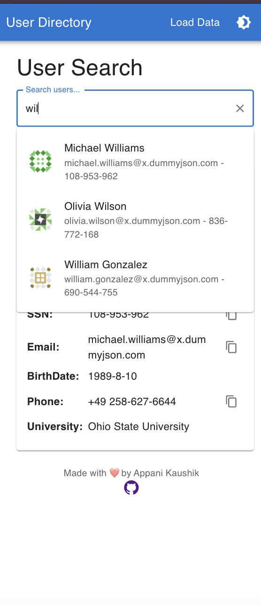

# User Search UI

This is a single-page React application using Material-UI that implements a typeahead search bar and a user details page. The UI is fully responsive and follows clean code practices, including atomic design, exception handling, environment layering, and externalized configurations.










## Features
- **Typeahead Search**: Provides real-time search suggestions as you type.
- **Lazy Loading**: The user details page is loaded on demand to improve performance.
- **Responsive Design**: Uses Material-UI for an adaptive layout on all screen sizes.
- **Environment Layering**: Configuration parameters are externalized.
- **Unit Test Cases**: Designed for testability with Jest and React Testing Library.

## Setup
1. Clone the repository:
   ```bash
   git clone https://github.com/kaushikappani/users-api.git
   cd users-api
   ```
2. Install dependencies:
   ```bash
   npm install
   ```
3. Start the development server:
   ```bash
   npm start
   ```

## Build and Run
To build the application for production:
```bash
npm run build
```
To serve the built app:
```bash
npx serve -s build
```

## Environment Configuration
The API base URL is configured in `config.js`:
```javascript
const config = {
  API_BASE_URL: "http://localhost:8080/api/users"
};

export default config;
```
Server GIT https://github.com/kaushikappani/users-api


